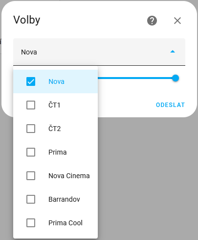

# Tv-Program
Tato integrace pro Home Assistant poskytuje senzory televizního programu pro české a slovenské kanály.

## Instalace

### Pomocí HACS

- Přidejte toto úložiště jako vlastní úložiště integrace a poté restartujte domácího asistenta
- V části Nastavení, zařízení a služby přidejte integraci a vyhledejte „Tv-Program“
 

### Ručně

- Stáhněte si repo a zkopírujte do adresáře custom_components/tv_program 

## Nastavení
- Ze seznamu vyberte kanály, které chcete sledovat, a nastavte počet dní pro zobrazení programu (výchozí je 7 dní).

## Změna nastavení
-Pokud změníte již jednou provedené nastavení, je potřeba znovu načíst integraci.
